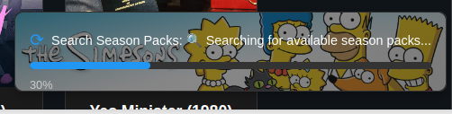

# Seasonarr

An intelligent Sonarr companion that automatically finds and downloads season packs for your TV shows, replacing individual episodes with high-quality complete seasons.

## Features

- **Automated Replacement**: Safely deletes existing episodes before downloading season packs
- **Real-time Progress**: Live WebSocket updates showing search and download progress
- **User Authentication**: Secure access control with JWT-based authentication
- **Multiple Sonarr Instances**: Individual Sonarr instance management
- **Modern UI**: Clean, responsive interface with dark theme
- **Mobile Friendly**: Works seamlessly on desktop and mobile devices
- **Bulk Operations**: Process multiple shows or seasons simultaneously
- **Activity Logging**: Comprehensive history of all operations and status
- **Smart Notifications**: Real-time notifications for operations and updates

## Screenshots

### Main Dashboard

*Library overview with show grid, statistics, search functionality, and quick "Season It!" actions*

### Advanced Filtering

*Comprehensive filtering options including genres, networks, year ranges, and runtime filters*

### Real-time Progress

*Live progress updates during seasoning 🧂*

### Show Details

*Detailed show information with season breakdown and bulk "Season It All!" functionality*

## Prerequisites

- **Docker** and **Docker Compose** installed
- **Sonarr** instance(s) running and accessible
- Network access between Seasonarr and Sonarr instances

## Quick Start

### Method 1: Docker Compose (Recommended)

1. **Create a docker-compose.yml file** (replace `sonarrNetwork` with your existing Docker network name):
   ```yaml
   services:
     seasonarr:
       image: ghcr.io/d3v1l1989/seasonarr:latest
       container_name: seasonarr
       restart: unless-stopped
       hostname: seasonarr
       ports:
         - "8000:8000"
       environment:
         - PUID=1000
         - PGID=1000
         - TZ=Etc/UTC
         - DATABASE_URL=sqlite:///./data/seasonarr.db
         - JWT_SECRET_KEY=change-this-to-a-secure-random-string
       volumes:
         - seasonarr_data:/app/data
         - /etc/localtime:/etc/localtime:ro
       depends_on:
         - seasonarr-db
       networks:
         - sonarrNetwork

     seasonarr-db:
       container_name: seasonarr-db
       image: alpine:latest
       command: ["sh", "-c", "mkdir -p /data && touch /data/seasonarr.db && tail -f /dev/null"]
       volumes:
         - seasonarr_data:/data
       networks:
         - sonarrNetwork

   volumes:
     seasonarr_data:

   networks:
     sonarrNetwork:
       external: true
   ```

2. **Start the application**:
   ```bash
   docker compose up -d
   ```

3. **Access Seasonarr**:
   - Open your browser to: `http://localhost:8000`
   - Complete the first-time setup to create your admin account

### Method 2: Standalone Docker

```bash
# Create a data volume
docker volume create seasonarr_data

# Run the container
docker run -d \
  --name seasonarr \
  -p 8000:8000 \
  -v seasonarr_data:/app/data \
  -e JWT_SECRET_KEY=your-secret-key-here \
  -e DATABASE_URL=sqlite:///./data/seasonarr.db \
  --restart unless-stopped \
  ghcr.io/d3v1l1989/seasonarr:latest
```


### First-Time Setup

1. **Access the application** at `http://localhost:8000`
2. **Create admin account** on the first-run setup page
3. **Add Sonarr instance(s)**:
   - Click the Sonarr selector dropdown
   - Add your Sonarr details:
     - **Name**: Friendly name (e.g., "Main Sonarr")
     - **URL**: Full Sonarr URL (e.g., `http://192.168.1.100:8989`)
     - **API Key**: Found in Sonarr Settings → General → Security

## Usage

### Basic Operations

1. **Browse Shows**: View all shows from your connected Sonarr instance(s)
2. **Season It!**: Click the season button to process individual seasons
3. **Show It!**: Click the show button to process all monitored seasons
4. **Bulk Operations**: Use the bulk selector to process multiple items

### The "Season It!" Process

1. **Validation**: Confirms show has monitored seasons with missing episodes (skips incomplete seasons)
2. **User Confirmation**: Optional deletion confirmation dialog based on user settings
3. **Search**: Queries Sonarr for available season pack releases
4. **Availability Check**: Checks if there are available season packs before doing any episode deletions
5. **Safe Deletion**: Removes existing episode files (unless "Skip Episode Deletion" is enabled)
6. **Download**: Instructs Sonarr to search for and download the season pack
7. **Monitor**: Tracks progress with real-time WebSocket updates and poster display

### Advanced Features

- **Smart Filtering**: Automatic detection of legitimate vs. fake releases
- **Progress Tracking**: Real-time WebSocket updates with detailed progress
- **Activity History**: Complete log of all operations and their outcomes
- **Notification System**: In-app notifications for important events
- **User Settings**: Customizable preferences and defaults

## Contributing

1. Fork the repository
2. Create a feature branch: `git checkout -b feature/amazing-feature`
3. Make your changes and test thoroughly
4. Commit changes: `git commit -m 'Add amazing feature'`
5. Push to branch: `git push origin feature/amazing-feature`
6. Open a Pull Request

## License

This project is licensed under the MIT License - see the [LICENSE](LICENSE) file for details.

## Support

- **Issues**: Report bugs and feature requests on GitHub Issues
- **Discussions**: Join the community discussions for help and ideas

## Disclaimer

This tool is designed to work with your existing legal media library. Users are responsible for ensuring compliance with applicable laws and terms of service of their indexers and download clients.